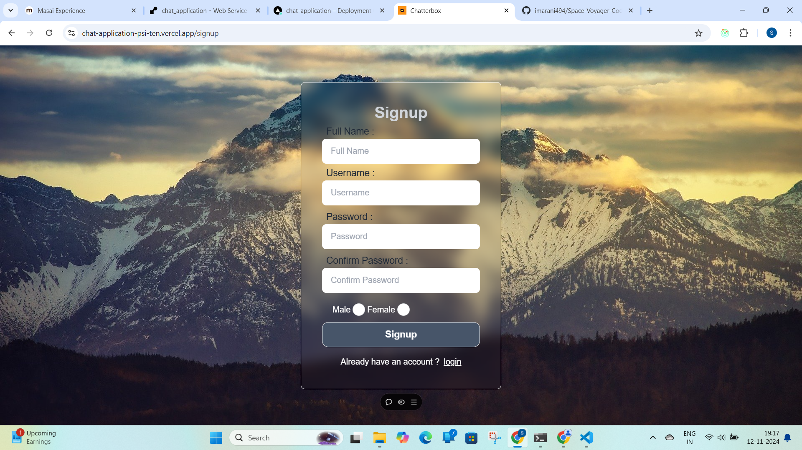
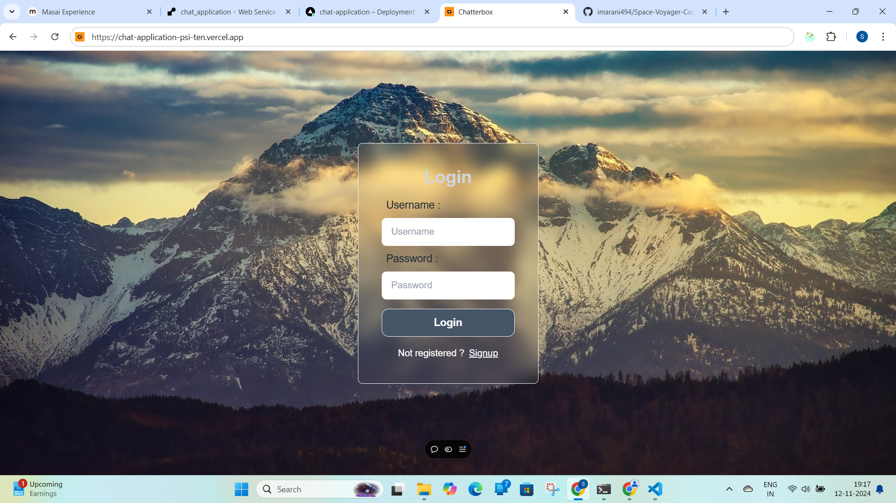

# Chat Application

This Chat Application is an online platform that enables users to interact with each other in real-time. It supports real-time messaging between users and integrates with ChatGPT to generate images and content that can be shared in conversations.

## Deployed Link
- [Chat Application on Vercel](https://chat-application-psi-ten.vercel.app/)

## Features
- **Real-time Chat**: Enables live, real-time messaging between two users.
- **User Authentication**: Users can sign up and log in to access the chat platform.
- **AI-powered Content Generation**: Users can generate images and content using ChatGPT, which can be sent to the other user.

## Tech Stack
- **Frontend**: HTML, CSS, React, Tailwind CSS, DaisyUI
- **Backend**: Node.js, Express
- **Real-time Communication**: Socket.IO
- **AI Integration**: OpenAI (ChatGPT)
- **Database**: MongoDB
- **Version Control**: Git

## Signup & login page

- **SignUp**: Users can register.
- **LogIn**: Registered users can log in to play





## Chatting Page

The Chatting Page is the core interface where users can engage in real-time conversations with each other. This page is designed to be simple and user-friendly, allowing users to send and receive messages instantly.

### Key Features
- **Real-time Messaging**: Messages are updated instantly across all connected users, providing a seamless chatting experience.
- **AI-Powered Content Generation**: Users can use an integrated ChatGPT feature to generate images or text content that can be shared directly in the chat.
- **User-Friendly Interface**: The chat interface is clean and intuitive, making it easy for users to navigate and interact.
- **Read Receipts**: Users can see when their messages have been read, enhancing the interaction experience.
- **Typing Indicators**: Real-time typing indicators let users know when the other person is typing, adding a more interactive feel to the conversation.

### Interface Overview
- **Message Area**: Displays the conversation history with messages aligned to the right for the user and left for the other participant.
- **Input Box**: Allows users to type messages or generate content with ChatGPT.
- **Send Button**: Sends the typed message instantly.
- **ChatGPT Button**: Generates AI-powered responses or images that can be shared in the chat.


# How to Run the Project
- Clone the repository.
- git clone https://github.com/Shouvick21/chat_application


# Install the dependencies for both frontend and backend
- cd .\frontend\
- npm install
- cd .\backend\
- npm install

# Start the server.
- node ./index.js

# Start the client.
- cd .\frontend\
- npm run dev


## Project Directory Structure
```plaintext
backend/
│
├── configs/
│   └── database.config.js
│
├── controllers/
│   ├── chatgpt.controller.js
│   ├── cron_job.js
│   ├── message.controller.js
│   └── user.controller.js
│
├── middleware/
│   └── authentication.js
│
├── models/
│   ├── conversation.model.js
│   ├── message.model.js
│   └── user.model.js
│
├── routes/
│   ├── chatGpt.route.js
│   ├── message.router.js
│   └── user.route.js
│
├── socket/
│   └── socket.js
│
├── utils/
│   ├── hassedpassword.js
│   ├── profilepic.js
│   └── token.js
│
├── .env
├── .gitignore
├── index.js
├── package-lock.json
└── package.json

frontend/
├── public/
│   └── index.html
│
├── src/
│   ├── app/
│   │   ├── store.js
│   │   └── features/
│   │       ├── homepage/
│   │       │   ├── Homepage.jsx
│   │       │   ├── parts/
│   │       │   │   ├── GenerateContent.jsx
│   │       │   │   ├── GenerateImage.jsx
│   │       │   │   ├── MessageContainer.jsx
│   │       │   │   └── SendMessage.jsx
│   │       │   ├── Sidebar.jsx
│   │       │   └── UserList.jsx
│   │       └── user/
│   │           └── userSlice.js
│   │
│   ├── assets/
│   ├── components/
│   │   ├── Login.jsx
│   │   ├── Signup.jsx
│   │   ├── PageNotFound.jsx
│   │   └── ProtectedRoute.jsx
│   │
│   ├── css/
│   │   └── style.css
│   │
│   ├── socket/
│   │   └── socketSlice.jsx
│   │
│   ├── utils/
│   │   ├── messageEncryption.js
│   │   └── toast.js
│   │
│   ├── App.jsx
│   ├── App.css
│   ├── index.css
│   ├── main.jsx
│   └── Vite.config.js
│
├── .env
├── .gitignore
├── tailwind.config.js
└── package.json

